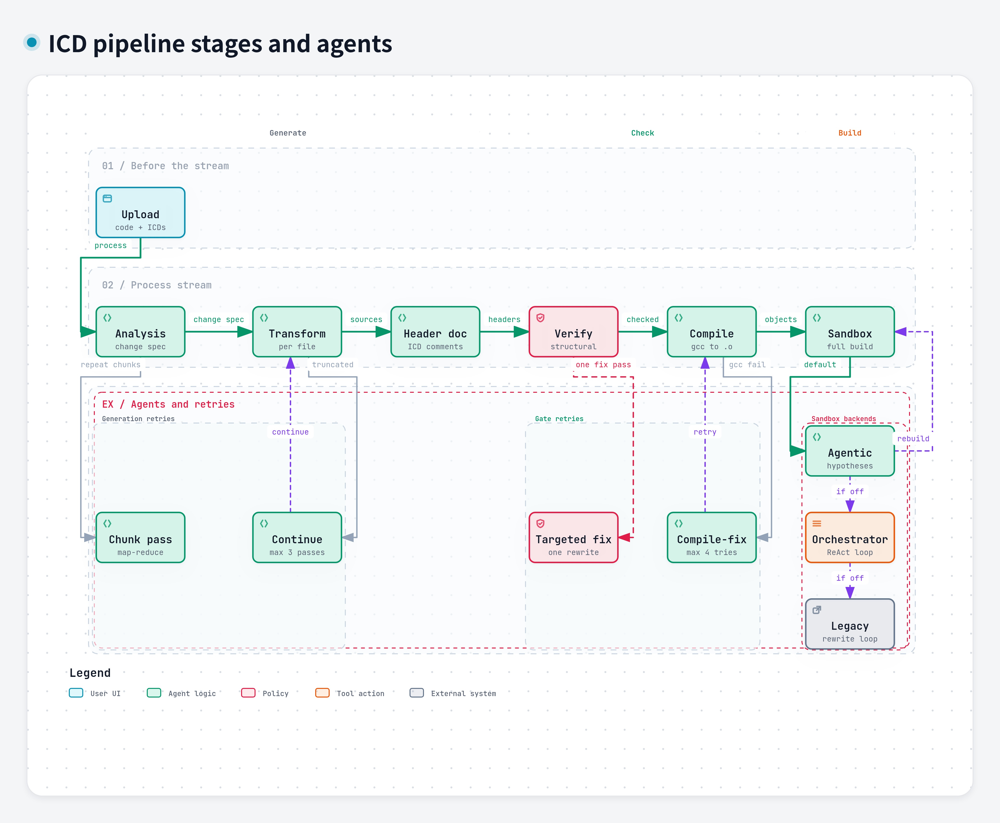

# Pipeline stages and agents

This is the workflow inside one processing session. It was drawn with [Archify](https://github.com/tt-a1i/archify) 3.0.1 and checked with that tool's showcase gates. The typed source is [`pipeline.workflow.json`](pipeline.workflow.json). The picture below is the JPEG Archify exported from that source.

The service map is in [runtime.md](runtime.md). This page is the work that happens after upload, inside `GET /api/process/{id}`.

## Happy path

The top row is the process stream, left to right:

1. **Upload** stores the code and both ICDs. It happens before the stream starts.
2. **Analysis** writes the change spec.
3. **Transform** rewrites each source file.
4. **Header doc** adds ICD comments to the generated headers. This step does not loop.
5. **Verify** runs structural checks.
6. **Compile** turns each `.c` into an object file.
7. **Sandbox** builds the repo.

## Where it repeats

The lower lane is the agents. A dashed arrow back up is another try.

- **Chunk pass** is how analysis walks a large ICD. The stream sends it `repeat chunks`.
- **Continue** is the transform agent. If a file is cut off, it comes back with `continue`, up to three passes.
- **Targeted fix** is one rewrite after verify still sees structural issues.
- **Compile-fix** edits the failing file and the declaring header, then `retry` sends it back to gcc. That loop stops after four tries. If the agent still left a compiler-named member off the existing struct, the gate adds the member from how the `.c` uses it.
- **Agentic** is the default sandbox debugger. `rebuild` sends the build back to Sandbox. Its own phases are build, triage, root cause, plan, patch, verify, and decide.

**Orchestrator** and **Legacy** are not extra steps after a successful agentic build. The `if off` links are the fallback order: orchestrator only when agentic is disabled, then the legacy rewrite loop. Each of those, once selected, rebuilds on its own errors. `REMOTE_BUILD_ENABLED` replaces this local choice with a remote build.

Regenerate skips analysis and starts again at transform, using the conversation plus the existing ICD context.
