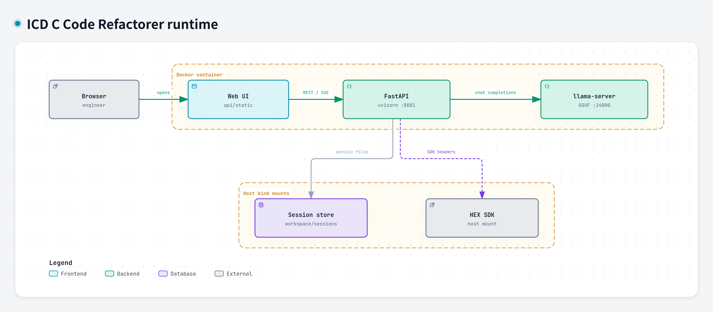

# Runtime architecture

This is the runtime map of a processing session. It was drawn with [Archify](https://github.com/tt-a1i/archify) 3.0.1 and checked with that tool's showcase gates. The typed source is [`runtime.architecture.json`](runtime.architecture.json). The picture below is the JPEG Archify exported from that source.

## What the boxes are

- **Browser** opens the page.
- **Web UI** is the SPA in `api/static`, served by FastAPI at `/static`.
- **FastAPI** (`uvicorn` on port 8081) runs the process stream: analysis, transform, verification, the per-file compile gate, and the sandbox build.
- **llama-server** (port 24000) serves the local GGUF. Chat completions go there directly.
- **Session store** is `workspace/sessions/<id>/`, where uploads and generated sources are written.
- **HEX SDK** is the host HALCON HEX / VirtuosoNext tree. The compile gate adds its include roots when that tree is mounted.

The dashed **Docker container** box is the entrypoint's process group. **Host bind mounts** are the session directory and the SDK, which stay on the host and are mounted in.

## How a request moves

1. The browser opens the Web UI.
2. The UI follows `REST / SSE` into `GET /api/process/{id}`.
3. FastAPI sends `chat completions` to llama-server.
4. FastAPI writes `session files` under the session directory.
5. The compile gate reads `SDK headers` from the mounted HEX SDK when one is present.

The entrypoint also starts LiteLLM on port 4000. Nothing in the process stream calls that URL.
